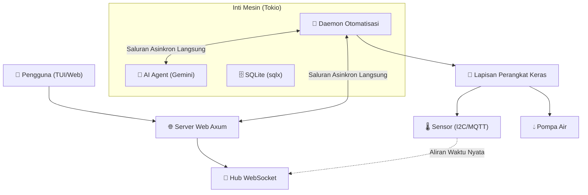

# 🏗️ AgroCLI Edge - Arsitektur Pertanian Pintar Performa Tinggi

## 📊 Ikhtisar Sistem

AgroCLI Edge adalah hub pertanian pintar terdistribusi yang dibangun sepenuhnya dengan **Rust**. Sistem ini menggunakan pola asinkron performa tinggi untuk mengelola data sensor, otomatisasi, dan visualisasi waktu nyata dengan overhead sumber daya minimal.

## 🔄 Aliran Data Performa Tinggi

Berbeda dengan sistem IoT tradisional yang mengandalkan permintaan HTTP yang berat untuk komunikasi internal, AgroCLI Edge menggunakan **Saluran Broadcast Tokio**.

### 1. Streaming Sensor Tanpa Latensi
1. **Daemon** membaca sensor perangkat keras setiap 5 detik.
2. Data dimasukkan ke dalam **saluran memori bersama** (`broadcast::Sender`).
3. **Server Web** dan **AI Agent** berlangganan langsung ke saluran ini.
4. Pembaruan muncul di dashboard dalam waktu <100ms.

### 2. Tool-Calling AI yang Cerdas
1. **AI Agent** menerima kueri bahasa alami.
2. AI memutuskan untuk menggunakan alat `get_garden_status`.
3. Agent mengeksekusi kueri database langsung melalui `sqlx`.
4. Jika tindakan diperlukan (misalnya, "Siram tanaman"), AI memicu `water_plant_action`.

## 📁 Struktur Proyek Modular

Proyek ini diabstraksikan ke dalam modul-modul yang saling terlepas:

- `src/main.rs`: Orkesrator tingkat tinggi dan titik masuk CLI.
- `src/core/`: Logika bisnis, aturan perawatan, dan kalkulasi tugas.
- `src/db/`: Interaksi SQLite asinkron menggunakan `sqlx`.
- `src/hardware/`: Lapisan abstraksi untuk sensor dan aktuator.
- `src/web/`: Server Axum yang menyediakan API REST dan hub WebSocket.
- `src/ai/`: Logika agen otonom bertenaga Gemini dan tool-calling.
- `src/tui/`: Dashboard terminal performa tinggi berbasis Ratatui.

## 🗄️ Persistensi yang Andal

Kami menggunakan **SQLite** dengan pengindeksan efisien untuk menangani riwayat sensor jangka panjang.

- **Tabel `plants`**: Menyimpan profil tanaman dan ambang batas kustom.
- **Tabel `sensor_logs`**: Dioptimalkan untuk penyimpanan data deret waktu (time-series).
- **Tabel `ai_logs`**: Catatan persisten tentang keputusan dan interaksi AI.

## 🔐 Keamanan & Fail-safe

- **Autentikasi**: Basic Auth untuk endpoint sensitif (Dashboard/API).
- **Lingkungan**: Semua rahasia dikelola melalui file `.env` yang terenkripsi.
- **Fail-safe Pompa**: Kunci berbasis perangkat lunak jika kelembaban tidak naik setelah 5 kali penyiraman berturut-turut untuk mencegah banjir.
- **Keamanan Asinkron**: Penggunaan `CancellationToken` untuk penghentian sistem yang aman (graceful shutdown).

## 🔄 Skalabilitas Masa Depan

- **Fase 4**: Pembelajaran mesin tingkat lanjut untuk pemodelan penguapan prediktif.
- **Fase 5**: Dukungan multi-node untuk manajemen rumah kaca skala besar.
- **Fase 6**: Sinkronisasi data P2P antar beberapa instance AgroCLI Edge.

---
**Performa Tinggi. Tanpa Latensi. Pertanian Pintar.**
