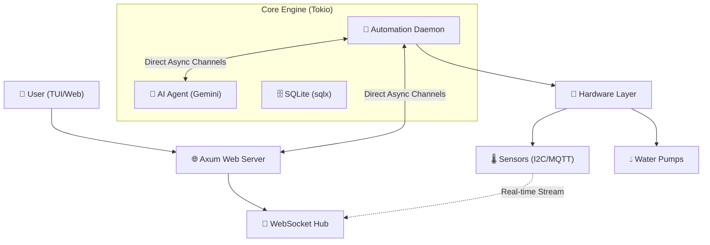

# 🏗️ AgroCLI Edge - High-Performance Smart Farming Architecture

## 📊 System Overview

AgroCLI Edge is a distributed smart farming hub built entirely in **Rust**. It utilizes high-performance asynchronous patterns to manage sensor data, automation, and real-time visualization with minimal resource overhead.

## 🔄 High-Performance Data Flow

Unlike traditional IoT systems that rely on overhead-heavy HTTP requests for internal communication, AgroCLI Edge uses **Tokio Broadcast Channels**.

### 1. Zero-Latency Sensor Streaming
1. **Daemon** reads hardware sensors every 5 seconds.
2. Data is injected into a **shared memory channel** (`broadcast::Sender`).
3. **Web Server** and **AI Agent** subscribe directly to this channel.
4. Updates appear on the dashboard in <100ms.

### 2. Intelligent AI Tool-Calling
1. **AI Agent** receives a natural language query.
2. AI decides to use the `get_garden_status` tool.
3. The Agent executes a direct database query via `sqlx`.
4. If action is needed (e.g., "Water the plant"), AI triggers `water_plant_action`.

## 📁 Modular Project Structure

The project is organized into highly decoupled modules:

- `src/main.rs`: High-level orchestrator and CLI entry points.
- `src/core/`: Business logic, care rules, and task calculation.
- `src/db/`: Asynchronous SQLite interactions using `sqlx`.
- `src/hardware/`: Abstraction layer for sensors and actuators.
- `src/web/`: Axum server providing REST APIs and WebSocket hub.
- `src/ai/`: Gemini-powered autonomous agent logic and tool-calling.
- `src/tui/`: Ratatui-based high-performance terminal dashboard.

## 🗄️ Reliable Persistence

We use **SQLite** with efficient indexing to handle long-term sensor history.

- **`plants` table**: Stores plant profiles and custom thresholds.
- **`sensor_logs` table**: Optimized for time-series data storage.
- **`ai_logs` table**: Persistent record of AI decisions and interactions.

## 🔐 Security & Failsafes

- **Authentication**: Basic Auth for sensitive endpoints (Dashboard/API).
- **Environment**: All secrets managed via encrypted `.env`.
- **Pump Failsafe**: Software-based lock if moisture doesn't rise after 5 consecutive pumps to prevent flooding.
- **Async Safety**: Use of `CancellationToken` for graceful shutdowns.

## 🔄 Future Scalability

- **Phase 4**: Advanced machine learning for predictive evaporation modeling.
- **Phase 5**: Multi-node support for large-scale greenhouse management.
- **Phase 6**: P2P data synchronization between multiple AgroCLI Edge instances.

---
**High Performance. Zero Latency. Smart Farming.**
